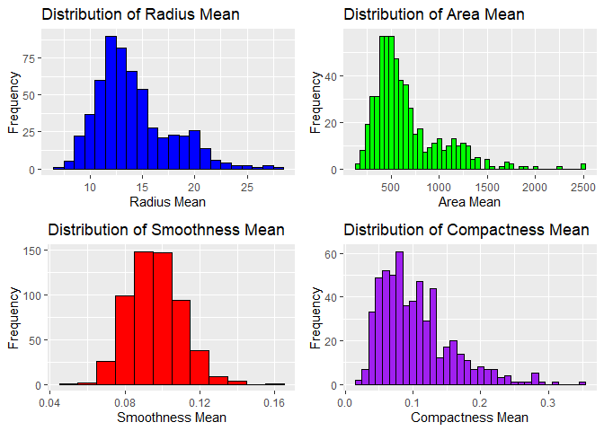
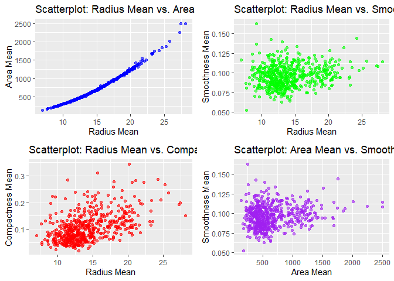
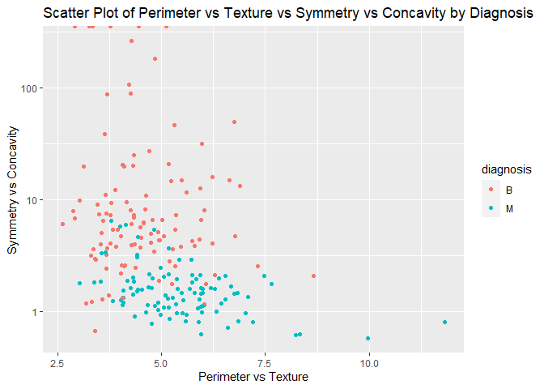
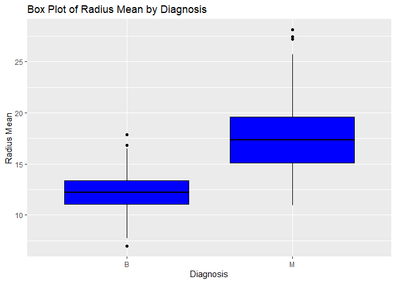
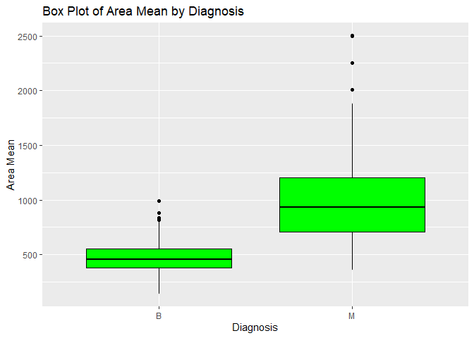
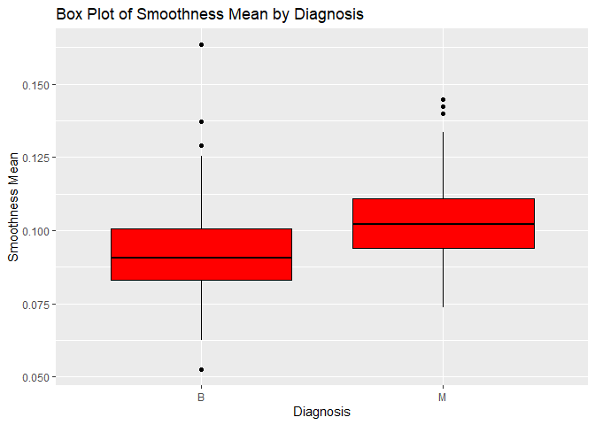
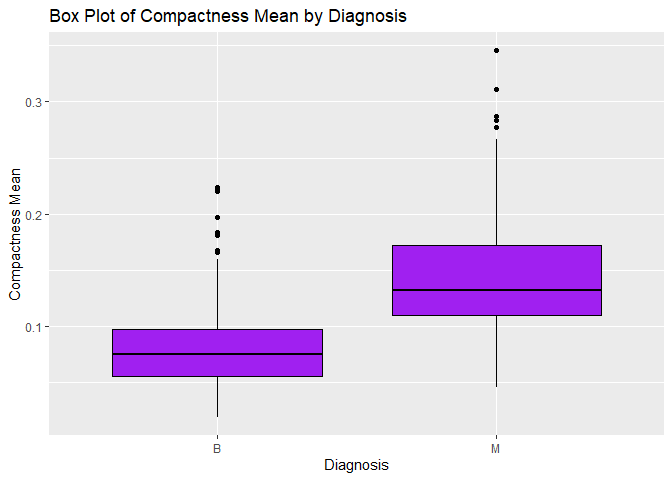

Mini Data-Analysis Deliverable 1
================

# Welcome to your (maybe) first-ever data analysis project!

And hopefully the first of many. Let’s get started:

1.  Install the [`datateachr`](https://github.com/UBC-MDS/datateachr)
    package by typing the following into your **R terminal**:

<!-- -->

    install.packages("devtools")
    devtools::install_github("UBC-MDS/datateachr")

2.  Load the packages below.

``` r
library(datateachr)
library(tidyverse)
```

    ## ── Attaching core tidyverse packages ──────────────────────── tidyverse 2.0.0 ──
    ## ✔ dplyr     1.1.3     ✔ readr     2.1.4
    ## ✔ forcats   1.0.0     ✔ stringr   1.5.0
    ## ✔ ggplot2   3.4.3     ✔ tibble    3.2.1
    ## ✔ lubridate 1.9.3     ✔ tidyr     1.3.0
    ## ✔ purrr     1.0.2     
    ## ── Conflicts ────────────────────────────────────────── tidyverse_conflicts() ──
    ## ✖ dplyr::filter() masks stats::filter()
    ## ✖ dplyr::lag()    masks stats::lag()
    ## ℹ Use the conflicted package (<http://conflicted.r-lib.org/>) to force all conflicts to become errors

``` r
library(dplyr)
library(ggplot2)
```

3.  Make a repository in the <https://github.com/stat545ubc-2023>
    Organization. You can do this by following the steps found on canvas
    in the entry called [MDA: Create a
    repository](https://canvas.ubc.ca/courses/126199/pages/mda-create-a-repository).
    One completed, your repository should automatically be listed as
    part of the stat545ubc-2023 Organization.

# Instructions

## For Both Milestones

- Each milestone has explicit tasks. Tasks that are more challenging
  will often be allocated more points.

- Each milestone will be also graded for reproducibility, cleanliness,
  and coherence of the overall Github submission.

- While the two milestones will be submitted as independent
  deliverables, the analysis itself is a continuum - think of it as two
  chapters to a story. Each chapter, or in this case, portion of your
  analysis, should be easily followed through by someone unfamiliar with
  the content.
  [Here](https://swcarpentry.github.io/r-novice-inflammation/06-best-practices-R/)
  is a good resource for what constitutes “good code”. Learning good
  coding practices early in your career will save you hassle later on!

- The milestones will be equally weighted.

## For Milestone 1

**To complete this milestone**, edit [this very `.Rmd`
file](https://raw.githubusercontent.com/UBC-STAT/stat545.stat.ubc.ca/master/content/mini-project/mini-project-1.Rmd)
directly. Fill in the sections that are tagged with
`<!--- start your work below --->`.

**To submit this milestone**, make sure to knit this `.Rmd` file to an
`.md` file by changing the YAML output settings from
`output: html_document` to `output: github_document`. Commit and push
all of your work to the mini-analysis GitHub repository you made
earlier, and tag a release on GitHub. Then, submit a link to your tagged
release on canvas.

**Points**: This milestone is worth 36 points: 30 for your analysis, and
6 for overall reproducibility, cleanliness, and coherence of the Github
submission.

# Learning Objectives

By the end of this milestone, you should:

- Become familiar with your dataset of choosing
- Select 4 questions that you would like to answer with your data
- Generate a reproducible and clear report using R Markdown
- Become familiar with manipulating and summarizing your data in tibbles
  using `dplyr`, with a research question in mind.

# Task 1: Choose your favorite dataset

The `datateachr` package by Hayley Boyce and Jordan Bourak currently
composed of 7 semi-tidy datasets for educational purposes. Here is a
brief description of each dataset:

- *apt_buildings*: Acquired courtesy of The City of Toronto’s Open Data
  Portal. It currently has 3455 rows and 37 columns.

- *building_permits*: Acquired courtesy of The City of Vancouver’s Open
  Data Portal. It currently has 20680 rows and 14 columns.

- *cancer_sample*: Acquired courtesy of UCI Machine Learning Repository.
  It currently has 569 rows and 32 columns.

- *flow_sample*: Acquired courtesy of The Government of Canada’s
  Historical Hydrometric Database. It currently has 218 rows and 7
  columns.

- *parking_meters*: Acquired courtesy of The City of Vancouver’s Open
  Data Portal. It currently has 10032 rows and 22 columns.

- *steam_games*: Acquired courtesy of Kaggle. It currently has 40833
  rows and 21 columns.

- *vancouver_trees*: Acquired courtesy of The City of Vancouver’s Open
  Data Portal. It currently has 146611 rows and 20 columns.

**Things to keep in mind**

- We hope that this project will serve as practice for carrying our your
  own *independent* data analysis. Remember to comment your code, be
  explicit about what you are doing, and write notes in this markdown
  document when you feel that context is required. As you advance in the
  project, prompts and hints to do this will be diminished - it’ll be up
  to you!

- Before choosing a dataset, you should always keep in mind **your
  goal**, or in other ways, *what you wish to achieve with this data*.
  This mini data-analysis project focuses on *data wrangling*,
  *tidying*, and *visualization*. In short, it’s a way for you to get
  your feet wet with exploring data on your own.

And that is exactly the first thing that you will do!

1.1 **(1 point)** Out of the 7 datasets available in the `datateachr`
package, choose **4** that appeal to you based on their description.
Write your choices below:

**Note**: We encourage you to use the ones in the `datateachr` package,
but if you have a dataset that you’d really like to use, you can include
it here. But, please check with a member of the teaching team to see
whether the dataset is of appropriate complexity. Also, include a
**brief** description of the dataset here to help the teaching team
understand your data.

<!-------------------------- Start your work below ---------------------------->

1: cancer_sample  
2: apt_buildings  
3: parking_meters  
4: vancouver_trees  

<!----------------------------------------------------------------------------->

1.2 **(6 points)** One way to narrowing down your selection is to
*explore* the datasets. Use your knowledge of dplyr to find out at least
*3* attributes about each of these datasets (an attribute is something
such as number of rows, variables, class type…). The goal here is to
have an idea of *what the data looks like*.

*Hint:* This is one of those times when you should think about the
cleanliness of your analysis. I added a single code chunk for you below,
but do you want to use more than one? Would you like to write more
comments outside of the code chunk?

<!-------------------------- Start your work below ---------------------------->

Reason for choice: **cancer samples**: I have chosen **cancer samples**
as I have a B.Sc. degree in Pharmaceutical Sciences and experience as an
analytical chemist in the field of medical science. I have an interest
in the diagnosis of cancer, particularly through the analysis of
volatile organic compounds (VOCs) in the headspace of cancer culture
samples using gas chromatography coupled with mass spectrometry (GC/MS).
Given my expertise with GC/MS, this research area is well-suited for me
to learn R data analysis using, for example, VOC analyses of cancer
samples.

However, in addition to dataset **cancer_sample**, I will explore
*apt_buildings, parking_meters, vancouver_trees* using dplyr attributes,
as follows.

``` r
### On cancer_sample dataset using functions filter(), select(), arrange() ###
filtered_cancer <- cancer_sample %>%
         filter(ID > 800000) %>%
  filter(ID < 80000000) %>%
         select(ID, radius_mean, area_mean, symmetry_mean) %>%
         arrange(desc(ID))
print(filtered_cancer, n = 10)
```

    ## # A tibble: 447 × 4
    ##         ID radius_mean area_mean symmetry_mean
    ##      <dbl>       <dbl>     <dbl>         <dbl>
    ##  1 9113846       12.3       465.         0.170
    ##  2 9113816       12.0       450.         0.185
    ##  3 9113778        9.67      289.         0.224
    ##  4 9113538       17.6       980.         0.170
    ##  5 9113514        9.67      286.         0.168
    ##  6 9113455       13.1       537.         0.156
    ##  7 9113239       13.2       543.         0.160
    ##  8 9113156       14.4       646.         0.171
    ##  9 9112712        9.76      291.         0.162
    ## 10 9112594       13         520.         0.167
    ## # ℹ 437 more rows

Reason for choice: *apt_buildings*: Living in Toronto is a privilege
that comes with advantages, but it also has its drawbacks. The rental
prices are high and availability is scarce, and also, landlord bylaws
enforce rules and regulations on apartment living that covers, for
example, amenities, balconies, bike parking, fire alarm testing, etc.
Leveraging the City of Toronto’s Open Data Portal as a data base for
machine learning with R can directly benefit not only prospective
tenants in Toronto, but also in other cities, such as Vancouver.

``` r
### On apt_buildings dataset using functions select(), arrange() ###
 apt_buildings %>%
 select(id, balconies, bike_parking, fire_alarm) %>%
   arrange(desc(id)) %>% 
   print(n = 5)
```

    ## # A tibble: 3,455 × 4
    ##      id balconies bike_parking  fire_alarm
    ##   <dbl> <chr>     <chr>         <chr>     
    ## 1 13813 YES       Not Available YES       
    ## 2 13812 YES       Not Available YES       
    ## 3 13811 YES       Not Available YES       
    ## 4 13810 YES       Not Available YES       
    ## 5 13809 YES       Not Available YES       
    ## # ℹ 3,450 more rows

Reason for choice: *parking meters*: Navigating Vancouver’s roadways has
become increasingly problematic rather than enjoyable. The rising cost
of gasoline, congested streets, ongoing construction, and the
introduction of new *parking meters* all contribute to the growing list
of challenges that Vancouver motorists face on a daily basis. The City
of Vancouver’s Open Data Portal offers a good resource for students to
learn R programming with all its benefits and challenges.

``` r
### On parking meters dataset using functions mutate(), select(), arrange() ###
   mutate_parking <- parking_meters %>%
          mutate(
            meter_id = as.numeric(ifelse(is.na(meter_id) | !grepl("^\\d+$", meter_id), "0", meter_id)),  # Convert "meter_id" to numeric (handling NAs and non-numeric values)
            meter_id_less = meter_id / 1000
          ) %>%
          select(pay_phone:latitude, time_in_effect, meter_id_less) %>%
          arrange(desc(pay_phone))  # Corrected the column name for sorting
        print(head(mutate_parking, n = 10))
```

    ## # A tibble: 10 × 5
    ##    pay_phone longitude latitude time_in_effect                     meter_id_less
    ##    <chr>         <dbl>    <dbl> <chr>                                      <dbl>
    ##  1 69999j        -123.     49.3 METER IN EFFECT: 9:00 AM TO 10:00…          611.
    ##  2 69999h        -123.     49.3 METER IN EFFECT: 9:00 AM TO 10:00…          611.
    ##  3 69999g        -123.     49.3 METER IN EFFECT: 9:00 AM TO 10:00…          611.
    ##  4 69999f        -123.     49.3 METER IN EFFECT: 9:00 AM TO 10:00…          611.
    ##  5 69999e        -123.     49.3 METER IN EFFECT: 9:00 AM TO 10:00…          611.
    ##  6 69999d        -123.     49.3 METER IN EFFECT: 9:00 AM TO 10:00…          611.
    ##  7 69999b        -123.     49.3 METER IN EFFECT: 9:00 AM TO 10:00…          611.
    ##  8 69999         -123.     49.3 METER IN EFFECT: 9:00 AM TO 10:00…          611.
    ##  9 69991         -123.     49.3 METER IN EFFECT: 9:00 AM TO 10:00…          232.
    ## 10 69989a        -123.     49.3 METER IN EFFECT: 9:00 AM TO 10:00…          122.

Reason for choice: *vancouver_trees*: In the spring, Vancouver city
streets are vibrant with colors of blooming cherries; during summer,
inviting shades of elm, maple, and linden offer pleasant walks; and in
autumn, captivating hues of fallen leaves remind us of the annual cycle
of nature. The City of Vancouver’s Open Data Portal is available to
students looking for learning in R programming as it gathers a vast of
information on the city’s trees, providing an excellent dataset for
educational purposes.

``` r
### On vancouver_trees dataset using functions group_by(), arrange(), mutate(), select() ###
group_trees <-
  vancouver_trees %>%
  group_by(genus_name) %>%
  group_by(species_name) %>%
  group_by(common_name) %>%
  arrange(tree_id) %>%
  mutate(rel_blocks = on_street_block - first(on_street_block)) %>%
  select(tree_id, genus_name, species_name, common_name, rel_blocks)
print(head(group_trees, n = 25))
```

    ## # A tibble: 25 × 5
    ## # Groups:   common_name [3]
    ##    tree_id genus_name species_name common_name                 rel_blocks
    ##      <dbl> <chr>      <chr>        <chr>                            <dbl>
    ##  1      12 FAGUS      SYLVATICA    EUROPEAN BEECH                       0
    ##  2      22 CARPINUS   BETULUS      EUROPEAN HORNBEAM                    0
    ##  3      23 CARPINUS   BETULUS      PYRAMIDAL EUROPEAN HORNBEAM          0
    ##  4      24 CARPINUS   BETULUS      EUROPEAN HORNBEAM                    0
    ##  5      25 CARPINUS   BETULUS      PYRAMIDAL EUROPEAN HORNBEAM          0
    ##  6      26 CARPINUS   BETULUS      EUROPEAN HORNBEAM                    0
    ##  7      27 CARPINUS   BETULUS      PYRAMIDAL EUROPEAN HORNBEAM          0
    ##  8      28 CARPINUS   BETULUS      PYRAMIDAL EUROPEAN HORNBEAM          0
    ##  9      29 CARPINUS   BETULUS      EUROPEAN HORNBEAM                    0
    ## 10      31 CARPINUS   BETULUS      PYRAMIDAL EUROPEAN HORNBEAM          0
    ## # ℹ 15 more rows

<!----------------------------------------------------------------------------->

1.3 **(1 point)** Now that you’ve explored the 4 datasets that you were
initially most interested in, let’s narrow it down to 1. What lead you
to choose this one? Briefly explain your choice below.

<!-------------------------- Start your work below ---------------------------->

I have chosen **cancer_sample** for the following reasons. Bacterial
cultures release VOCs, which present opportunities for rapid
diagnostics. Analytical chemistry techniques that detect VOCs can be
used as valuable tools for biomarker discovery for rapid diagnosis of
diseases. VOCs have been measured in bacterial growth of cystic
fibrosis-related pathogens (Metabolites 2021, 11, 773,
<https://doi.org/10.3390/metabo11110773>) or in prostate cancer (Cancers
2022, 14(16), 3982, <https://doi.org/10.3390/cancers14163982>), and used
as signaling agents for diagnostic purposes. In addition to measuring
VOCs from cancer tissue cultures, tumor diagnosis could be improved if
we gained deeper insights into the disease and map cancer tissue
characteristics, such as radius, area, smoothness, compactness, etc. The
development and customization of machine learning algorithms in R would
be necessary to achieve this goal and enable efficient data management
and processing in cancer research and diagnostics.

<!----------------------------------------------------------------------------->

1.4 **(2 points)** Time for a final decision! Going back to the
beginning, it’s important to have an *end goal* in mind. For example, if
I had chosen the `titanic` dataset for my project, I might’ve wanted to
explore the relationship between survival and other variables. Try to
think of 1 research question that you would want to answer with your
dataset. Note it down below.

<!-------------------------- Start your work below ---------------------------->

I selected the **cancer_sample** dataset, because I want to investigate
whether there is a relationship between cancer growth and its
characteristic parameters, such as cancer radius, area, smoothness or
compactness. Cancer can be diagnosed by analyzing VOCs with analytical
techniques, such as GC/MS in tissue cultures, and after diagnosis,
cancer growth could be monitored by measuring a representative cancer
parameter that reliably characterizes tumor development and status.

**Question:** Is there a cancer parameter, such as radius, area,
smoothness or compactness that can be used to trace tumor advancement,
quickly and accurately?

To answer that question, I want to conduct statistical analyses in R to
find that specific cancer parameter, and use algorithms and statistical
analyses to characterize cancer state and severity in a quantitative
manner.

<!----------------------------------------------------------------------------->

# Important note

Read Tasks 2 and 3 *fully* before starting to complete either of them.
Probably also a good point to grab a coffee to get ready for the fun
part!

This project is semi-guided, but meant to be *independent*. For this
reason, you will complete tasks 2 and 3 below (under the **START HERE**
mark) as if you were writing your own exploratory data analysis report,
and this guidance never existed! Feel free to add a brief introduction
section to your project, format the document with markdown syntax as you
deem appropriate, and structure the analysis as you deem appropriate. If
you feel lost, you can find a sample data analysis
[here](https://www.kaggle.com/headsortails/tidy-titarnic) to have a
better idea. However, bear in mind that it is **just an example** and
you will not be required to have that level of complexity in your
project.

# Task 2: Exploring your dataset

If we rewind and go back to the learning objectives, you’ll see that by
the end of this deliverable, you should have formulated *4* research
questions about your data that you may want to answer during your
project. However, it may be handy to do some more exploration on your
dataset of choice before creating these questions - by looking at the
data, you may get more ideas. **Before you start this task, read all
instructions carefully until you reach START HERE under Task 3**.

2.1 **(12 points)** Complete *4 out of the following 8 exercises* to
dive deeper into your data. All datasets are different and therefore,
not all of these tasks may make sense for your data - which is why you
should only answer *4*.

Make sure that you’re using dplyr and ggplot2 rather than base R for
this task. Outside of this project, you may find that you prefer using
base R functions for certain tasks, and that’s just fine! But part of
this project is for you to practice the tools we learned in class, which
is dplyr and ggplot2.

1.  Plot the distribution of a numeric variable.
2.  Create a new variable based on other variables in your data (only if
    it makes sense)
3.  Investigate how many missing values there are per variable. Can you
    find a way to plot this?
4.  Explore the relationship between 2 variables in a plot.
5.  Filter observations in your data according to your own criteria.
    Think of what you’d like to explore - again, if this was the
    `titanic` dataset, I may want to narrow my search down to passengers
    born in a particular year…
6.  Use a boxplot to look at the frequency of different observations
    within a single variable. You can do this for more than one variable
    if you wish!
7.  Make a new tibble with a subset of your data, with variables and
    observations that you are interested in exploring.
8.  Use a density plot to explore any of your variables (that are
    suitable for this type of plot).

<!-------------------------- Start your work below ---------------------------->

1.  Plot the distribution of a numeric variable

``` r
library(dplyr)
library(ggplot2)
library(gridExtra)
```

    ## 
    ## Attaching package: 'gridExtra'

    ## The following object is masked from 'package:dplyr':
    ## 
    ##     combine

``` r
# Creating a distribution plot for 'radius_mean'
radius_mean_plot <- ggplot(cancer_sample, aes(x = radius_mean)) +
  geom_histogram(binwidth = 1, fill = "blue", color = "black") +
  labs(x = "Radius Mean", y = "Frequency") +
  ggtitle("Distribution of Radius Mean")

# Creating a distribution plot for 'area_mean'
area_mean_plot <- ggplot(cancer_sample, aes(x = area_mean)) +
  geom_histogram(binwidth = 50, fill = "green", color = "black") +
  labs(x = "Area Mean", y = "Frequency") +
  ggtitle("Distribution of Area Mean")

# Creating a distribution plot for 'smoothness_mean'
smoothness_mean_plot <- ggplot(cancer_sample, aes(x = smoothness_mean)) +
  geom_histogram(binwidth = 0.01, fill = "red", color = "black") +
  labs(x = "Smoothness Mean", y = "Frequency") +
  ggtitle("Distribution of Smoothness Mean")

# Creating a distribution plot for 'compactness_mean'
compactness_mean_plot <- ggplot(cancer_sample, aes(x = compactness_mean)) +
  geom_histogram(binwidth = 0.01, fill = "purple", color = "black") +
  labs(x = "Compactness Mean", y = "Frequency") +
  ggtitle("Distribution of Compactness Mean")

# Arranging and displaying the plots in a grid
grid_plot <- grid.arrange(radius_mean_plot, area_mean_plot, smoothness_mean_plot, compactness_mean_plot, ncol = 2)
```

<!-- -->

``` r
# Printing the grid of plots
print(grid_plot)
```

    ## TableGrob (2 x 2) "arrange": 4 grobs
    ##   z     cells    name           grob
    ## 1 1 (1-1,1-1) arrange gtable[layout]
    ## 2 2 (1-1,2-2) arrange gtable[layout]
    ## 3 3 (2-2,1-1) arrange gtable[layout]
    ## 4 4 (2-2,2-2) arrange gtable[layout]

2.  Create a new variable based on other variables in your data

``` r
# Creating new columns 'area_vs_radius' and 'compactness_vs_smoothness' with function mutate(), select()

cancer_mutate <- cancer_sample %>%
  mutate(area_vs_radius = area_mean / radius_mean) %>%
mutate(compactness_vs_smoothness = compactness_mean / smoothness_mean) %>%
 select(diagnosis, area_vs_radius, compactness_vs_smoothness)
print(cancer_mutate)
```

    ## # A tibble: 569 × 3
    ##    diagnosis area_vs_radius compactness_vs_smoothness
    ##    <chr>              <dbl>                     <dbl>
    ##  1 M                   55.6                     2.34 
    ##  2 M                   64.5                     0.928
    ##  3 M                   61.1                     1.46 
    ##  4 M                   33.8                     1.99 
    ##  5 M                   63.9                     1.32 
    ##  6 M                   38.3                     1.33 
    ##  7 M                   57.0                     1.15 
    ##  8 M                   42.2                     1.38 
    ##  9 M                   40.0                     1.52 
    ## 10 M                   38.2                     2.02 
    ## # ℹ 559 more rows

4.  Explore the relationship between 2 variables in a plot

``` r
library(ggplot2)
library(gridExtra)

# Scatterplot for 'radius_mean' vs. 'area_mean'
scatterplot1 <- ggplot(cancer_sample, aes(x = radius_mean, y = area_mean)) +
  geom_point(color = "blue", alpha = 0.6) +
  labs(x = "Radius Mean", y = "Area Mean") +
  ggtitle("Scatterplot: Radius Mean vs. Area Mean")

# Scatterplot for 'radius_mean' vs. 'smoothness_mean'
scatterplot2 <- ggplot(cancer_sample, aes(x = radius_mean, y = smoothness_mean)) +
  geom_point(color = "green", alpha = 0.6) +
  labs(x = "Radius Mean", y = "Smoothness Mean") +
  ggtitle("Scatterplot: Radius Mean vs. Smoothness Mean")

# Scatterplot for 'radius_mean' vs. 'compactness_mean'
scatterplot3 <- ggplot(cancer_sample, aes(x = radius_mean, y = compactness_mean)) +
  geom_point(color = "red", alpha = 0.6) +
  labs(x = "Radius Mean", y = "Compactness Mean") +
  ggtitle("Scatterplot: Radius Mean vs. Compactness Mean")

# Scatterplot for 'area_mean' vs. 'smoothness_mean'
scatterplot4 <- ggplot(cancer_sample, aes(x = area_mean, y = smoothness_mean)) +
  geom_point(color = "purple", alpha = 0.6) +
  labs(x = "Area Mean", y = "Smoothness Mean") +
  ggtitle("Scatterplot: Area Mean vs. Smoothness Mean")

# Arranging and displaying the scatterplots in a grid
scatterplot_grid <- grid.arrange(scatterplot1, scatterplot2, scatterplot3, scatterplot4, ncol = 2)
```

<!-- -->

``` r
# Printing the grid of scatterplots
print(scatterplot_grid)
```

    ## TableGrob (2 x 2) "arrange": 4 grobs
    ##   z     cells    name           grob
    ## 1 1 (1-1,1-1) arrange gtable[layout]
    ## 2 2 (1-1,2-2) arrange gtable[layout]
    ## 3 3 (2-2,1-1) arrange gtable[layout]
    ## 4 4 (2-2,2-2) arrange gtable[layout]

5.  Filter observations in your data according to your own criteria.
    Think of what you’d like to explore.

``` r
# Mutate() cancer_sample for new columns 'perimeter_vs_texture' and 'symmetry_vs_concavity', select() columns, filter() observations.

  cancer_explore <- cancer_sample %>%
    mutate(perimeter_vs_texture = perimeter_mean / texture_mean,
    symmetry_vs_concavity = symmetry_mean / concavity_mean) %>%
    select(ID, diagnosis, perimeter_vs_texture, symmetry_vs_concavity) %>%
    filter(ID > 800000 & ID < 900000)
   
    # Printing the first 10 rows of cancer_explore
  print(cancer_explore, n = 10)
```

    ## # A tibble: 209 × 4
    ##        ID diagnosis perimeter_vs_texture symmetry_vs_concavity
    ##     <dbl> <chr>                    <dbl>                 <dbl>
    ##  1 842302 M                        11.8                  0.806
    ##  2 842517 M                         7.48                 2.09 
    ##  3 843786 M                         5.26                 1.32 
    ##  4 844359 M                         5.99                 1.59 
    ##  5 844981 M                         4.01                 1.26 
    ##  6 845636 M                         4.42                 4.63 
    ##  7 846226 M                         5.34                 1.16 
    ##  8 846381 M                         4.33                 1.86 
    ##  9 848406 M                         4.71                 2.14 
    ## 10 849014 M                         5.87                 1.07 
    ## # ℹ 199 more rows

``` r
  # Creating a scatterplot for 'perimeter_vs_texture' and 'symmetry_vs_concavity' by 'diagnosis'. Applying log10 scale for Y axis.
  
  cancer_scatter <- ggplot(cancer_explore, aes(x = perimeter_vs_texture, y = symmetry_vs_concavity, color = diagnosis)) +
    geom_point() +
    labs(x = "Perimeter vs Texture", y = "Symmetry vs Concavity") +
    ggtitle("Scatter Plot of Perimeter vs Texture vs Symmetry vs Concavity by Diagnosis") +
    scale_y_log10() 
  
  print(cancer_scatter)
```

<!-- -->

6.  Use a boxplot to look at the frequency of different observations
    within a single variable. You can do this for more than one variable
    if you wish!

``` r
# Loading the required library
library(ggplot2)

# Data frame is in 'cancer_sample'
# Creating a box plot for 'radius_mean'
radius_mean_boxplot <- ggplot(cancer_sample, aes(x = diagnosis, y = radius_mean)) +
  geom_boxplot(fill = "blue", color = "black") +
  labs(x = "Diagnosis", y = "Radius Mean") +
  ggtitle("Box Plot of Radius Mean by Diagnosis")

# Printing the box plot
print(radius_mean_boxplot)
```

<!-- -->

``` r
# Loading the required library
library(ggplot2)

# Data frame is in 'cancer_sample'
# Creating a box plot for 'area_mean'
area_mean_boxplot <- ggplot(cancer_sample, aes(x = diagnosis, y = area_mean)) +
  geom_boxplot(fill = "green", color = "black") +
  labs(x = "Diagnosis", y = "Area Mean") +
  ggtitle("Box Plot of Area Mean by Diagnosis")

# Printing the box plot
print(area_mean_boxplot)
```

<!-- -->

``` r
# Loading the required library
library(ggplot2)

# Data frame is in 'cancer_sample'
# Creating a box plot for 'smoothness_mean'
smoothness_mean_boxplot <- ggplot(cancer_sample, aes(x = diagnosis, y = smoothness_mean)) +
  geom_boxplot(fill = "red", color = "black") +
  labs(x = "Diagnosis", y = "Smoothness Mean") +
  ggtitle("Box Plot of Smoothness Mean by Diagnosis")

# Printing the box plot
print(smoothness_mean_boxplot)
```

<!-- -->

``` r
# Loading the required library
library(ggplot2)

# Data frame is in 'cancer_sample'
# Creating a box plot for 'compactness_mean'
compactness_mean_boxplot <- ggplot(cancer_sample, aes(x = diagnosis, y = compactness_mean)) +
  geom_boxplot(fill = "purple", color = "black") +
  labs(x = "Diagnosis", y = "Compactness Mean") +
  ggtitle("Box Plot of Compactness Mean by Diagnosis")

# Printing the box plot
print(compactness_mean_boxplot)
```

<!-- -->

8.Use a density plot to explore any of your variables

``` r
# Loading the library
library(ggplot2)

# Creating a density plot for 'radius_mean' by Diagnosis
radius_mean_density_plot <- ggplot(cancer_sample, aes(x = radius_mean, fill = diagnosis)) +
  geom_density(alpha = 0.5) +  # Use alpha for transparency
  labs(x = "Radius Mean", y = "Density") +
  ggtitle("Density Plot of Radius Mean by Diagnosis")

# Printing the density plot
print(radius_mean_density_plot)
```

<!-- -->

``` r
# Loading the library
library(ggplot2)

# Creating a density plot for 'area_mean' by Diagnosis
area_mean_density_plot <- ggplot(cancer_sample, aes(x = area_mean, fill = diagnosis)) +
  geom_density(alpha = 0.5) +  # Use alpha for transparency
  labs(x = "Area Mean", y = "Density") +
  ggtitle("Density Plot of Area Mean by Diagnosis")

# Printing the density plot
print(area_mean_density_plot)
```

<!-- -->

``` r
# Loading the library
library(ggplot2)

# Creating a density plot for 'smoothness_mean' by Diagnosis
smoothness_mean_density_plot <- ggplot(cancer_sample, aes(x = smoothness_mean, fill = diagnosis)) +
  geom_density(alpha = 0.5) +  # Use alpha for transparency
  labs(x = "Smoothness Mean", y = "Density") +
  ggtitle("Density Plot of Smoothness Mean by Diagnosis")

# Printing the density plot
print(smoothness_mean_density_plot)
```

<!-- -->

``` r
# Loading the library
library(ggplot2)

# Creating a density plot for 'compactness_mean' by Diagnosis
compactness_mean_density_plot <- ggplot(cancer_sample, aes(x = compactness_mean, fill = diagnosis)) +
  geom_density(alpha = 0.5) +  # Use alpha for transparency
  labs(x = "Compactness Mean", y = "Density") +
  ggtitle("Density Plot of Compactness Mean by Diagnosis")

# Printing the density plot
print(compactness_mean_density_plot)
```

<!-- -->
<!----------------------------------------------------------------------------->

2.2 **(4 points)** For each of the 4 exercises that you complete,
provide a *brief explanation* of why you chose that exercise in relation
to your data (in other words, why does it make sense to do that?), and
sufficient comments for a reader to understand your reasoning and code.

<!-------------------------- Start your work below ---------------------------->

Explanation why I chose a particular Exercise in relation to
**cancer_sample** data

1.  Plot the distribution of a numeric variable.

While the assignment was to plot only one numeric variable, I plotted
four variables, because in tumor diagnostics, it is important to assess
all available data to determine whether there is any interrelationship
among these variables that might influence the development of cancer.
Tumor size can be expressed as radius and (surface) area, and tissue
consistency can be expressed as surface smoothness (or roughness) and
compactness (i.e., hardness). As the first step of investigating cancer
etiology, we need to determine if there is any distribution (normal, or
other) of these numeric values and their correlation with one another.

2.  Create a new variable based on other variables in your data.

The cancer parameters investigated seem to follow a normal distribution,
therefore, the next step is to find out if there is any
interconnectedness between them. The best way to do this is to start
with two parameters and their relationship. A common approach is to work
with their relative abundance that means obtaining their abundance ratio
and investigate if the ratio follows any pattern. Hence, I created two
new columns called ‘area_vs_radius’ and ‘compactness_vs_smoothness’ to
calculate the ratios of those parameters.

4.  Explore the relationship between 2 variables in a plot.

To follow the strategy as outlined above, plots were made with two
variables, and data show a good correlation between tumor radius and
area meaning that any of the two parameters can be used as a diagnostic
tool (refer to plot ‘Scatterplot: Radius Mean vs. Area Mean’). Medical
personnel would likely measure tumor radius, rather than tumor surface
area, to determine cancer growth and status, mostly because of the
feasibility of the test. The remaining three plots show a scattered data
profile suggesting that tumor radius cannot be directly correlated with
smoothness or compactness, or tumor area with smoothness.

5.  Filter observations in your data according to your own criteria.
    Think of what you’d like to explore.

Using appropriate functions available in dplyr, I created new columns to
calculate relative ratios of numerical values of tumor variables and
filtered the observations to the required margins. I also created a
scatter plot to demonstrate the relationship within the ratios of
‘Symmetry vs Concavity’ in the function of ‘Perimeter vs Texture’. Using
log scale on the Y-axis for better visualization, this plot offers the
initial assessment that these tumor parameters do not directly correlate
to one another, hence they may not be optimal parameters to characterize
tumor stage.

6.  Use a boxplot to look at the frequency of different observations
    within a single variable.

I created box plots showing distribution of numerical values of tumor
parameters between diagnosis groups. These plots provide quick
information on the symmetry, variance, and outliers, and the visual
inspection of the plots show that the ‘radius_mean’ would be an ideal
parameter to determine tumor growth and status, because groups B and M
are well separated in size, and group M data show the least skew and
outliers.

8.  Use a density plot to explore any of your variables

In addition to the histograms presented in Exercise 1 (Plot the
distribution of a numeric variable), I constructed density plots to
visualize data distribution and the peaks of most concentrated values.
Using the same tumor parameters as in Exercise 1 (i.e., radius_mean,
area_mean, smoothness_mean, compactness_mean), the plot ‘Density Plot of
Radius Mean by Diagnosis’ confirms that tumor radius may be the optimal
parameter to characterize cancer status and development. Compared to the
rest of the plots, in this plot, the distributions of groups B and M are
the most separated and tumor radius have a region (approx. radius mean
20) where the signal is specific to group M tumors and not contaminated
with signals from group B.
<!----------------------------------------------------------------------------->

# Task 3: Choose research questions

**(4 points)** So far, you have chosen a dataset and gotten familiar
with it through exploring the data. You have also brainstormed one
research question that interested you (Task 1.4). Now it’s time to pick
4 research questions that you would like to explore in Milestone 2!
Write the 4 questions and any additional comments below.

<!--- *****START HERE***** --->

Task 3: Choose research questions

**Question 1:** Is there any (normal or not normal) distribution that
the cancer parameters I selected (i.e., radius_mean, area_mean,
smoothness_mean, compactness_mean) follow? *Comments:* distribution
plots have been generated and assessed.

**Question 2:** Does it provide better data analysis if I plot
normalized values rather than absolute numbers? *Comments:* New
variables, i.e., ratios of the numerical values of cancer parameters
‘area_vs_radius’ and ‘compactness_vs_smoothness’ were created and
plotted.

**Question 3:** Can I find a correlation between two cancer parameters?
*Comments:* Scatter plots between two variables were created, plotted
and inspected.

**Question 4:** Can box plots help me find the ideal cancer parameter to
monitor cancer growth and status compared to other parameters and benign
tumors? *Comments:* I am looking for well-separated boxes over the
Y-axis between benign and malignant groups, and for the latter, the
group should have the least overlap with the benign group with
acceptable symmetry, low variance and minimal skew.

**Question 5:** Can I confirm the findings from the box plot with
another type of distribution plot? *Comments:* I am expecting a similar
pattern of distribution for cancer parameters as found with the box
plots. The best separated signals between benign and malignant tumor
groups will be used. The malignant tumor curve should have a region
where the signal is clean and not overlapped with the benign tumor data.

**Conclusion**: Based on the data analysis, tumor radius and area almost
equally could be used to monitor cancer growth and status. In the box
plots, both parameters show good separation between the benign and
malignant groups, and in the density plots, the malignant group’s signal
has clean regions without any overlap with the benign cohorts. However,
since measuring tumor radius is easier than measuring cancer area, I
conclude that cancer tumor radius should be proposed as a tool to follow
cancer development and status.

<!----------------------------->

# Overall reproducibility/Cleanliness/Coherence Checklist

## Coherence (0.5 points)

The document should read sensibly from top to bottom, with no major
continuity errors. An example of a major continuity error is having a
data set listed for Task 3 that is not part of one of the data sets
listed in Task 1.

## Error-free code (3 points)

For full marks, all code in the document should run without error. 1
point deduction if most code runs without error, and 2 points deduction
if more than 50% of the code throws an error.

## Main README (1 point)

There should be a file named `README.md` at the top level of your
repository. Its contents should automatically appear when you visit the
repository on GitHub.

Minimum contents of the README file:

- In a sentence or two, explains what this repository is, so that
  future-you or someone else stumbling on your repository can be
  oriented to the repository.
- In a sentence or two (or more??), briefly explains how to engage with
  the repository. You can assume the person reading knows the material
  from STAT 545A. Basically, if a visitor to your repository wants to
  explore your project, what should they know?

Once you get in the habit of making README files, and seeing more README
files in other projects, you’ll wonder how you ever got by without them!
They are tremendously helpful.

## Output (1 point)

All output is readable, recent and relevant:

- All Rmd files have been `knit`ted to their output md files.
- All knitted md files are viewable without errors on Github. Examples
  of errors: Missing plots, “Sorry about that, but we can’t show files
  that are this big right now” messages, error messages from broken R
  code
- All of these output files are up-to-date – that is, they haven’t
  fallen behind after the source (Rmd) files have been updated.
- There should be no relic output files. For example, if you were
  knitting an Rmd to html, but then changed the output to be only a
  markdown file, then the html file is a relic and should be deleted.

(0.5 point deduction if any of the above criteria are not met. 1 point
deduction if most or all of the above criteria are not met.)

Our recommendation: right before submission, delete all output files,
and re-knit each milestone’s Rmd file, so that everything is up to date
and relevant. Then, after your final commit and push to Github, CHECK on
Github to make sure that everything looks the way you intended!

## Tagged release (0.5 points)

You’ve tagged a release for Milestone 1.

### Attribution

Thanks to Icíar Fernández Boyano for mostly putting this together, and
Vincenzo Coia for launching.
