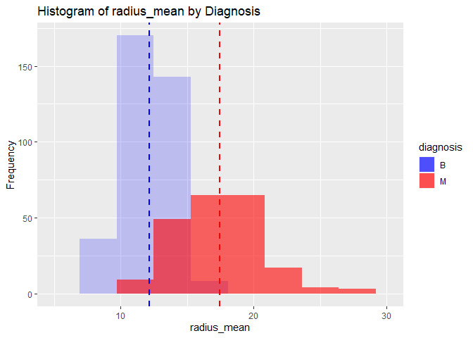
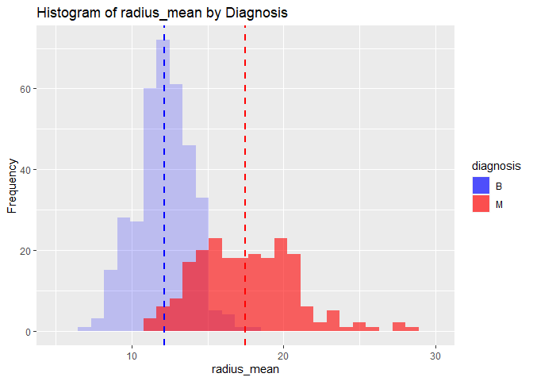
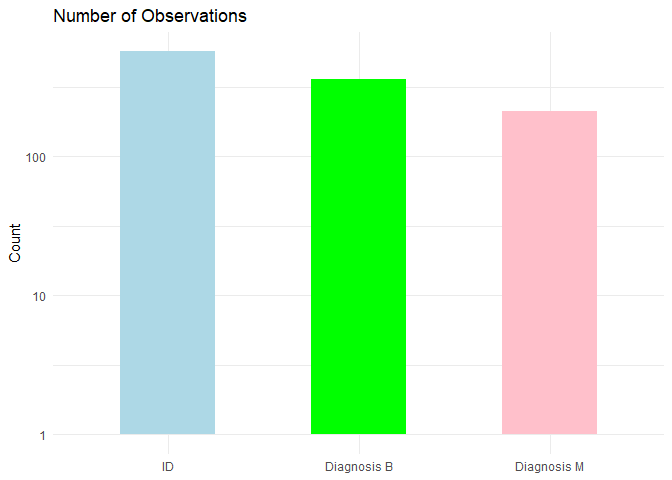
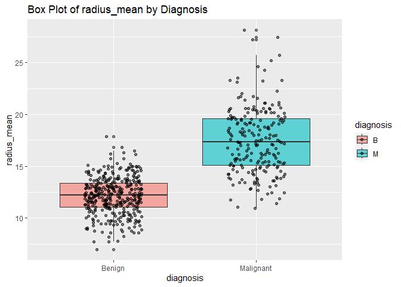
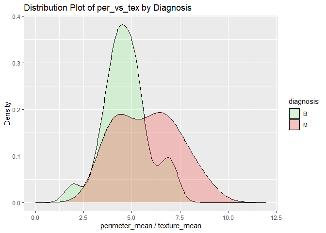
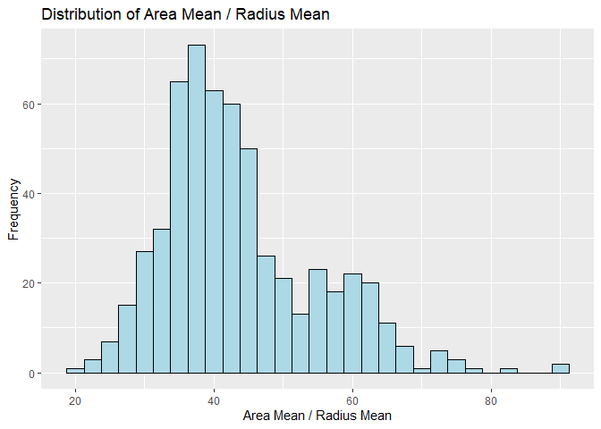
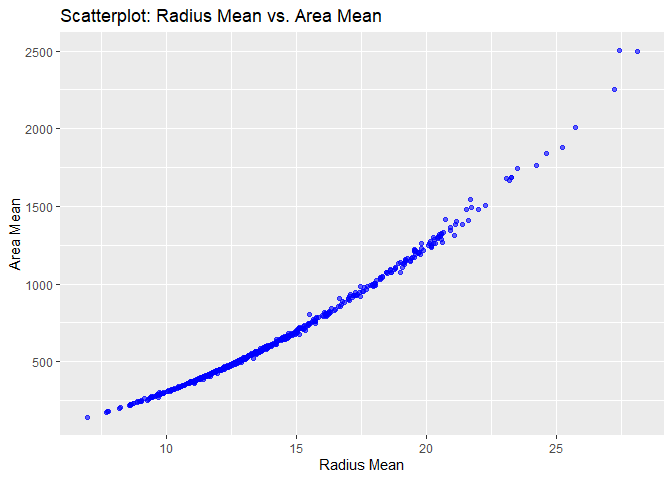

Mini Data Analysis Milestone 2
================

*To complete this milestone, you can either edit [this `.rmd`
file](https://raw.githubusercontent.com/UBC-STAT/stat545.stat.ubc.ca/master/content/mini-project/mini-project-2.Rmd)
directly. Fill in the sections that are commented out with
`<!--- start your work here--->`. When you are done, make sure to knit
to an `.md` file by changing the output in the YAML header to
`github_document`, before submitting a tagged release on canvas.*

# Welcome to the rest of your mini data analysis project!

In Milestone 1, you explored your data. and came up with research
questions. This time, we will finish up our mini data analysis and
obtain results for your data by:

- Making summary tables and graphs
- Manipulating special data types in R: factors and/or dates and times.
- Fitting a model object to your data, and extract a result.
- Reading and writing data as separate files.

We will also explore more in depth the concept of *tidy data.*

**NOTE**: The main purpose of the mini data analysis is to integrate
what you learn in class in an analysis. Although each milestone provides
a framework for you to conduct your analysis, it’s possible that you
might find the instructions too rigid for your data set. If this is the
case, you may deviate from the instructions – just make sure you’re
demonstrating a wide range of tools and techniques taught in this class.

# Instructions

**To complete this milestone**, edit [this very `.Rmd`
file](https://raw.githubusercontent.com/UBC-STAT/stat545.stat.ubc.ca/master/content/mini-project/mini-project-2.Rmd)
directly. Fill in the sections that are tagged with
`<!--- start your work here--->`.

**To submit this milestone**, make sure to knit this `.Rmd` file to an
`.md` file by changing the YAML output settings from
`output: html_document` to `output: github_document`. Commit and push
all of your work to your mini-analysis GitHub repository, and tag a
release on GitHub. Then, submit a link to your tagged release on canvas.

**Points**: This milestone is worth 50 points: 45 for your analysis, and
5 for overall reproducibility, cleanliness, and coherence of the Github
submission.

**Research Questions**: In Milestone 1, you chose two research questions
to focus on. Wherever realistic, your work in this milestone should
relate to these research questions whenever we ask for justification
behind your work. In the case that some tasks in this milestone don’t
align well with one of your research questions, feel free to discuss
your results in the context of a different research question.

# Learning Objectives

By the end of this milestone, you should:

- Understand what *tidy* data is, and how to create it using `tidyr`.
- Generate a reproducible and clear report using R Markdown.
- Manipulating special data types in R: factors and/or dates and times.
- Fitting a model object to your data, and extract a result.
- Reading and writing data as separate files.

# Setup

Begin by loading your data and the tidyverse package below:

``` r
library(datateachr) # <- might contain the data you picked!
library(tidyverse)
library(dplyr)
library(ggplot2)
```

# Task 1: Process and summarize your data

From milestone 1, you should have an idea of the basic structure of your
dataset (e.g. number of rows and columns, class types, etc.). Here, we
will start investigating your data more in-depth using various data
manipulation functions.

### 1.1 (1 point)

First, write out the 4 research questions you defined in milestone 1
were. This will guide your work through milestone 2:

<!-------------------------- Start your work below ---------------------------->

1.  *Is there any (normal or not normal) distribution that the cancer
    parameters I selected (i.e., radius_mean, area_mean,
    smoothness_mean, compactness_mean) follow?*
2.  *Does it provide better data analysis if I plot normalized values
    rather than absolute numbers?*
3.  *Can I find a correlation between two cancer parameters?*
4.  *Can box plots help me find the ideal cancer parameter to monitor
    cancer growth and status compared to other parameters and benign
    tumors?*
    <!----------------------------------------------------------------------------->

Here, we will investigate your data using various data manipulation and
graphing functions.

### 1.2 (8 points)

Now, for each of your four research questions, choose one task from
options 1-4 (summarizing), and one other task from 4-8 (graphing). You
should have 2 tasks done for each research question (8 total). Make sure
it makes sense to do them! (e.g. don’t use a numerical variables for a
task that needs a categorical variable.). Comment on why each task helps
(or doesn’t!) answer the corresponding research question.

Ensure that the output of each operation is printed!

Also make sure that you’re using dplyr and ggplot2 rather than base R.
Outside of this project, you may find that you prefer using base R
functions for certain tasks, and that’s just fine! But part of this
project is for you to practice the tools we learned in class, which is
dplyr and ggplot2.

**Summarizing:**

1.  Compute the *range*, *mean*, and *two other summary statistics* of
    **one numerical variable** across the groups of **one categorical
    variable** from your data.
2.  Compute the number of observations for at least one of your
    categorical variables. Do not use the function `table()`!
3.  Create a categorical variable with 3 or more groups from an existing
    numerical variable. You can use this new variable in the other
    tasks! *An example: age in years into “child, teen, adult, senior”.*
4.  Compute the proportion and counts in each category of one
    categorical variable across the groups of another categorical
    variable from your data. Do not use the function `table()`!

**Graphing:**

6.  Create a graph of your choosing, make one of the axes logarithmic,
    and format the axes labels so that they are “pretty” or easier to
    read.
7.  Make a graph where it makes sense to customize the alpha
    transparency.

Using variables and/or tables you made in one of the “Summarizing”
tasks:

8.  Create a graph that has at least two geom layers.
9.  Create 3 histograms, with each histogram having different sized
    bins. Pick the “best” one and explain why it is the best.

Make sure it’s clear what research question you are doing each operation
for!

<!------------------------- Start your work below ----------------------------->

**cancer_sample** dataset

**Combination 1:**

*Summarizing (1a):*

Option 1: *Compute the range, mean, and two other summary statistics . .
.*

I computed the range, mean, standard deviation and coefficient of
variation of *radius_mean* (numerical variable) across *B* and *M*
(categorical variables).

``` r
#Calculating the range of 'radius_mean' for diagnosis 'B'
range_radius_B <- range(cancer_sample$radius_mean[cancer_sample$diagnosis == 'B'])
print(range_radius_B)
```

    ## [1]  6.981 17.850

``` r
#Calculating the range of 'radius_mean' for diagnosis 'M'
range_radius_M <- range(cancer_sample$radius_mean[cancer_sample$diagnosis == 'M'])
print(range_radius_M)
```

    ## [1] 10.95 28.11

``` r
#Calculating the total mean of 'radius_mean' for diagnosis 'B'
mean_radius_B <- mean(cancer_sample$radius_mean[cancer_sample$diagnosis == 'B'])
print(mean_radius_B)
```

    ## [1] 12.14652

``` r
#Calculating the total mean of 'radius_mean' for diagnosis 'M'
mean_radius_M <- mean(cancer_sample$radius_mean[cancer_sample$diagnosis == 'M'])
print(mean_radius_M)
```

    ## [1] 17.46283

``` r
#Calculating the standard deviation of 'radius_mean' for diagnosis 'B'
sd_radius_B <- sd(cancer_sample$radius_mean[cancer_sample$diagnosis == 'B'])
print(sd_radius_B)
```

    ## [1] 1.780512

``` r
#Calculating the standard deviation of 'radius_mean' for diagnosis 'M'
sd_radius_M <- sd(cancer_sample$radius_mean[cancer_sample$diagnosis == 'M'])
print(sd_radius_M)
```

    ## [1] 3.203971

``` r
#Calculating the coefficient of variation of 'radius_mean' for diagnosis 'B'
cv_radius_B <- (sd_radius_B / mean_radius_B *100)
print(cv_radius_B)
```

    ## [1] 14.65861

``` r
#Calculating the coefficient of variation of 'radius_mean' for diagnosis 'M'
cv_radius_M <- (sd_radius_M / mean_radius_M *100)
print(cv_radius_M)
```

    ## [1] 18.34738

*Graphing (1b):*

Option 9: *Create 3 histograms with different size bins; pick the “best”
and explain.*

Histogram with bin size 10 (dashed line denotes the mean)

``` r
# Creating a histogram for 'B' and 'M' diagnoses
Plot1 <- ggplot(cancer_sample, aes(x = radius_mean, fill = diagnosis)) +
  geom_histogram(data = subset(cancer_sample, diagnosis == 'B'), alpha = 0.2, bins = 10) +
  geom_histogram(data = subset(cancer_sample, diagnosis == 'M'), alpha = 0.6, bins = 10) +
  geom_vline(xintercept = 12.14652, linetype = "dashed", color = "blue", linewidth = 0.8) +
  geom_vline(xintercept = 17.46283, linetype = "dashed", color = "red", linewidth = 0.8) +
  ylab("Frequency") +
  xlab("radius_mean") +
  ggtitle("Histogram of radius_mean by Diagnosis") +
  scale_x_continuous(limits = c(5, 30)) +
  scale_fill_manual(values = c("B" = "blue", "M" = "red"))

print(Plot1)
```

    ## Warning: Removed 2 rows containing missing values (`geom_bar()`).
    ## Removed 2 rows containing missing values (`geom_bar()`).

<!-- -->

Histogram with bin size 50 (dashed line denotes the mean)

``` r
# Creating a histogram for 'B' and 'M' diagnoses
Plot1 <- ggplot(cancer_sample, aes(x = radius_mean, fill = diagnosis)) +
  geom_histogram(data = subset(cancer_sample, diagnosis == 'B'), alpha = 0.2, bins = 50) +
  geom_histogram(data = subset(cancer_sample, diagnosis == 'M'), alpha = 0.6, bins = 50) +
  geom_vline(xintercept = 12.14652, linetype = "dashed", color = "blue", linewidth = 0.8) +
  geom_vline(xintercept = 17.46283, linetype = "dashed", color = "red", linewidth = 0.8) +
  ylab("Frequency") +
  xlab("radius_mean") +
  ggtitle("Histogram of radius_mean by Diagnosis") +
  scale_x_continuous(limits = c(5, 30)) +
  scale_fill_manual(values = c("B" = "blue", "M" = "red"))

print(Plot1)
```

    ## Warning: Removed 2 rows containing missing values (`geom_bar()`).
    ## Removed 2 rows containing missing values (`geom_bar()`).

<!-- -->

Histogram with bin size 30 (dashed line denotes the mean)

In my view, histogram bin size 30 is the best. A bin size 10 is
cumbersome and obscures subtle details, while bin size 50 is too
detailed and holds the reader’s focus for an extended period without
providing additional information than bin size 30 could offer.

``` r
# Creating a histogram for 'B' and 'M' diagnoses
Plot1 <- ggplot(cancer_sample, aes(x = radius_mean, fill = diagnosis)) +
  geom_histogram(data = subset(cancer_sample, diagnosis == 'B'), alpha = 0.2, bins = 30) +
  geom_histogram(data = subset(cancer_sample, diagnosis == 'M'), alpha = 0.6, bins = 30) +
  geom_vline(xintercept = 12.14652, linetype = "dashed", color = "blue", linewidth = 0.8) +
  geom_vline(xintercept = 17.46283, linetype = "dashed", color = "red", linewidth = 0.8) +
  ylab("Frequency") +
  xlab("radius_mean") +
  ggtitle("Histogram of radius_mean by Diagnosis") +
  scale_x_continuous(limits = c(5, 30)) +
  scale_fill_manual(values = c("B" = "blue", "M" = "red"))

print(Plot1)
```

    ## Warning: Removed 2 rows containing missing values (`geom_bar()`).
    ## Removed 2 rows containing missing values (`geom_bar()`).

<!-- -->

**Combination 2:**

*Summarizing (2a):*

Option 2: *Compute the number of observations for at least one of your
categorical variables*

I computed the number of observations for categorical variables ID,
diagnosis B and M.

``` r
# Selecting categories "ID" and "diagnosis" in cancer_sample dataset
cancer_IDd <- cancer_sample[c("ID", "diagnosis")]
# Create a new data frame with the selected columns
cancer_cat <- data.frame(cancer_IDd)

# Calculating the number of observations for "ID"
count_ID <- nrow(cancer_cat)

# Calculating the number of observations for "diagnosis" values "B" and "M"
count_B <- sum(cancer_cat$diagnosis == "B")
count_M <- sum(cancer_cat$diagnosis == "M")

# Printing the number of observations
cat("Number of observations for ID:", count_ID, "\n")
```

    ## Number of observations for ID: 569

``` r
cat("Number of observations for 'diagnosis' value 'B':", count_B, "\n")
```

    ## Number of observations for 'diagnosis' value 'B': 357

``` r
cat("Number of observations for 'diagnosis' value 'M':", count_M, "\n")
```

    ## Number of observations for 'diagnosis' value 'M': 212

*Graphing (2b):*

Option 6: *Create a graph of your choosing, make one of the axes
logarithmic . . . *

I have generated a bar plot using the number of observations for ID, B,
and M. To optimize the use of plot space and minimize empty areas, I
applied a logarithmic scale to the y-axis, allowing the bars to fill the
plot more effectively compared to a standard linear scale.

``` r
# Loading the ggplot2 library
library(ggplot2)

# Creating a data frame for the number of observations
count_data <- data.frame(Category = c("ID", "Diagnosis B", "Diagnosis M"),
                         Count = c(count_ID, count_B, count_M))

# Settings factors for categories
count_data$Category <- factor(count_data$Category, levels = c("ID", "Diagnosis B", "Diagnosis M"))

# Creating a bar plot for the number of observations with a log scale on the y-axis
cancer_bar <- ggplot(count_data, aes(x = Category, y = Count, fill = Category)) +
  geom_bar(stat = "identity", width = 0.5) +
  labs(title = "Number of Observations", x = NULL, y = "Count") +
  theme_minimal() +
  scale_fill_manual(values = c("lightblue", "green", "pink")) +
  guides(fill = "none") +  # Remove the legend
  scale_y_log10()  # Apply log scale to the y-axis
 print(cancer_bar)
```

<!-- -->

**Combination 3:**

*Summarizing (3a):*

Option 3: *Create a categorical variable with three or more groups from
an existing numerical variable.*

I created a categorical variable ‘parameter’ with numerical variables I
calculated earlier (under Combination 1, Summarizing: 1a, Option 1) as
follows, ‘mean of radius_mean’, ‘sd of radius_mean’, ‘cv of radius_mean’

``` r
# Calculating the statistics
mean_radius_B <- mean(cancer_sample$radius_mean[cancer_sample$diagnosis == 'B'])
mean_radius_M <- mean(cancer_sample$radius_mean[cancer_sample$diagnosis == 'M'])
sd_radius_B <- sd(cancer_sample$radius_mean[cancer_sample$diagnosis == 'B'])
sd_radius_M <- sd(cancer_sample$radius_mean[cancer_sample$diagnosis == 'M'])
cv_radius_B <- (sd_radius_B / mean_radius_B * 100)
cv_radius_M <- (sd_radius_M / mean_radius_M * 100)

# Creating a data frame with the calculated values
cancerStat <- data.frame(
  parameter = c("mean of radius_mean", "mean of radius_mean", "sd of radius_mean", "sd of radius_mean", "cv of radius_mean", "cv of radius_mean"),
  diagnosis = c("B", "M", "B", "M", "B", "M"),
  value = c(mean_radius_B, mean_radius_M, sd_radius_B, sd_radius_M, cv_radius_B, cv_radius_M)
)

# Printing the data frame
print(cancerStat)
```

    ##             parameter diagnosis     value
    ## 1 mean of radius_mean         B 12.146524
    ## 2 mean of radius_mean         M 17.462830
    ## 3   sd of radius_mean         B  1.780512
    ## 4   sd of radius_mean         M  3.203971
    ## 5   cv of radius_mean         B 14.658611
    ## 6   cv of radius_mean         M 18.347376

*Graphing (3b):*

Option 8: *Create a graph that has at least two geom layers*

I created a box plot that has two geom layers (i.e., B, M).

``` r
# Loading the necessary library
library(ggplot2)

# Creating a box plot with two geom layers for 'B' and 'M', one each.
Plot2 <- ggplot(cancer_sample, aes(x = diagnosis, y = radius_mean, fill = diagnosis)) +
  geom_boxplot(alpha = 0.6) +
  geom_jitter(position = position_jitter(0.2), alpha = 0.5) +  # Add jitter points
  ylab("radius_mean") +
  ggtitle("Box Plot of radius_mean by Diagnosis") +
  scale_x_discrete(labels = c("B" = "Benign", "M" = "Malignant"))

print(Plot2)
```

<!-- -->

**Combination 4:**

*Summarizing (4a):*

Option 4: *Compute the proportion and counts in each category of one
categorical variable across the groups of another categorical variable
from your data.*

Using the categorical variable ‘perimeter_mean’ and ‘texture_mean’, I
computed their ratio ‘perimeter_vs_texture’ in a column
‘characteristic’, and did this across the categorical variables ID and
diagnosis and placed the counts in column ‘ratio’. The ID was filtered
between 85000 and 100000.

``` r
# Filtering the data for 'B' and calculate 'per_vs_tex' values
per_vs_tex_B <- with(cancer_sample[which(cancer_sample$diagnosis == 'B' & cancer_sample$ID >= 85000 & cancer_sample$ID <= 100000), ],
                     perimeter_mean / texture_mean)

# Filtering the data for 'M' and calculate 'per_vs_tex' values
per_vs_tex_M <- with(cancer_sample[which(cancer_sample$diagnosis == 'M' & cancer_sample$ID >= 85000 & cancer_sample$ID <= 100000), ],
                     perimeter_mean / texture_mean)

# Creating a vector for 'ID' within the specified range for both 'B' and 'M'
cancer_ID_B <- with(cancer_sample[which(cancer_sample$diagnosis == 'B' & cancer_sample$ID >= 85000 & cancer_sample$ID <= 100000), ], ID)
cancer_ID_M <- with(cancer_sample[which(cancer_sample$diagnosis == 'M' & cancer_sample$ID >= 85000 & cancer_sample$ID <= 100000), ], ID)

# Creating a data frame with the calculated values for 'B' and 'M' separately
cancerStat2_B <- data.frame(
  ID = cancer_ID_B,
  characteristic = "perimeter_vs_texture",
  diagnosis = "B",
  ratio = per_vs_tex_B
)

cancerStat2_M <- data.frame(
  ID = cancer_ID_M,
  characteristic = "perimeter_vs_texture",
  diagnosis = "M",
  ratio = per_vs_tex_M
)

# Combining the data frames for 'B' and 'M'
cancerStat2 <- rbind(cancerStat2_B, cancerStat2_M)

print(head(cancerStat2))
```

    ##      ID       characteristic diagnosis    ratio
    ## 1 86211 perimeter_vs_texture         B 4.360426
    ## 2 86408 perimeter_vs_texture         B 3.957129
    ## 3 86409 perimeter_vs_texture         B 4.978626
    ## 4 86561 perimeter_vs_texture         B 5.138873
    ## 5 87106 perimeter_vs_texture         B 5.418196
    ## 6 87127 perimeter_vs_texture         B 7.082389

*Graphing (4b):*

Option 7: *Make a graph where it makes sense to customize the alpha
transparency*

I created an overlayed density plot of ‘perimeter_mean’ vs
‘texture_mean’ by diagnosis. Since the two graphs have lare areas where
they overlap, the experience of the reader could be improved by changing
the alpha value for B and M. Graph B (green, alpha 0.1) and M (red,
alpha 0.2) give the reader the impression that graph B is in the front
and graph M is in the back; which is also reinforced by the colour
change in the area where B overlaps M.

``` r
# Creating a distribution plot with separate alpha for 'B' and 'M'
ggplot(cancerStat2, aes(x = ratio, fill = diagnosis, alpha = diagnosis)) +
  geom_density() +
  labs(
    title = "Distribution Plot of per_vs_tex by Diagnosis",
    x = "perimeter_mean / texture_mean",
    y = "Density"
  ) +
  scale_fill_manual(values = c("B" = "green", "M" = "red")) +  # Custom colors for 'B' and 'M'
  scale_alpha_manual(values = c("B" = 0.1, "M" = 0.2)) +  # Custom alpha values for 'B' and 'M'
  scale_x_continuous(limits = c(0, 12))  # Set the x-axis scale limits
```

<!-- -->

<!----------------------------------------------------------------------------->

### 1.3 (2 points)

Based on the operations that you’ve completed, how much closer are you
to answering your research questions? Think about what aspects of your
research questions remain unclear. Can your research questions be
refined, now that you’ve investigated your data a bit more? Which
research questions are yielding interesting results?

<!------------------------- Write your answer here ---------------------------->

Based on the operations I have completed, I can narrow down the
questions I am asking. After normalizing certain parameters, it still
remains unclear whether normalized parameters or absolute values provide
better data to monitor cancer growth. More data analysis would be
necessary with combinations of additional normalization of parameters to
find out if there is an optimal combination to follow cancer
development. In lieu of that data, absolute values will be used further
on to simplify data handling. A promising trend is emerging with a
potentially strong correlation between radius_mean and area_mean that
may narrow the focus of further investigations. Based on the information
gathered so far, the original four research questions can be refined as
follows.

Refining research question 3, *Can I find a correlation between two
cancer parameters?*

**New research question 1:**

Is it appropriate to use ‘radius_mean’ to monitor cancer development?

Refining research question 2, *Does it provide better data analysis if I
plot normalized values rather than absolute numbers?*

**New research question 2:**

Is it appropriate to use ‘radius_mean’ absolute values?

<!----------------------------------------------------------------------------->

# Task 2: Tidy your data

In this task, we will do several exercises to reshape our data. The goal
here is to understand how to do this reshaping with the `tidyr` package.

A reminder of the definition of *tidy* data:

- Each row is an **observation**
- Each column is a **variable**
- Each cell is a **value**

### 2.1 (2 points)

Based on the definition above, can you identify if your data is tidy or
untidy? Go through all your columns, or if you have \>8 variables, just
pick 8, and explain whether the data is untidy or tidy.

<!--------------------------- Start your work below --------------------------->

Yes, *cancer_sample* dataset is tidy.

*cancer_sample* dataset contains 569 observations (rows) and 32
variables (columns). Selecting eight variables: Columns ID to
compactness_mean. Values are contained in cells, and the data types in
cells are uniform and clean. Two types of variables are present, i.e.,
numeric and character. One variable contains characters (‘diagnosis’)
and the rest of the variables contain numeric values in separate
columns. Each observation is in a separate row and represents a single
observation. Values in cells are not intermixed, i.e., one cell contains
either one numeric value, or one character, but not both, or not more
than one value (of the same type, or other) in a cell. Therefore, it is
concluded that *cancer_sample* data set is tidy.

<!----------------------------------------------------------------------------->

### 2.2 (4 points)

Now, if your data is tidy, untidy it! Then, tidy it back to it’s
original state.

If your data is untidy, then tidy it! Then, untidy it back to it’s
original state.

Be sure to explain your reasoning for this task. Show us the “before”
and “after”.

<!--------------------------- Start your work below --------------------------->

**Before** untidying *cancer_sample* dataset.

``` r
head(cancer_sample)
```

    ## # A tibble: 6 × 32
    ##         ID diagnosis radius_mean texture_mean perimeter_mean area_mean
    ##      <dbl> <chr>           <dbl>        <dbl>          <dbl>     <dbl>
    ## 1   842302 M                18.0         10.4          123.      1001 
    ## 2   842517 M                20.6         17.8          133.      1326 
    ## 3 84300903 M                19.7         21.2          130       1203 
    ## 4 84348301 M                11.4         20.4           77.6      386.
    ## 5 84358402 M                20.3         14.3          135.      1297 
    ## 6   843786 M                12.4         15.7           82.6      477.
    ## # ℹ 26 more variables: smoothness_mean <dbl>, compactness_mean <dbl>,
    ## #   concavity_mean <dbl>, concave_points_mean <dbl>, symmetry_mean <dbl>,
    ## #   fractal_dimension_mean <dbl>, radius_se <dbl>, texture_se <dbl>,
    ## #   perimeter_se <dbl>, area_se <dbl>, smoothness_se <dbl>,
    ## #   compactness_se <dbl>, concavity_se <dbl>, concave_points_se <dbl>,
    ## #   symmetry_se <dbl>, fractal_dimension_se <dbl>, radius_worst <dbl>,
    ## #   texture_worst <dbl>, perimeter_worst <dbl>, area_worst <dbl>, …

**After** untidying *cancer_sample* dataset.

``` r
# Loading the tidyr package
library(tidyr)

# Making untidy sample data
cancer_untidy0 <- cancer_sample

# Untidying the data by pivoting it into a longer format
cancer_untidy <- cancer_untidy0 %>%
  pivot_longer(
    cols = -c(ID, diagnosis),
    names_to = "measurement",
    values_to = "value"
  )

# Printing the first 15 rows of the untidy data
print(head(cancer_untidy))
```

    ## # A tibble: 6 × 4
    ##       ID diagnosis measurement         value
    ##    <dbl> <chr>     <chr>               <dbl>
    ## 1 842302 M         radius_mean        18.0  
    ## 2 842302 M         texture_mean       10.4  
    ## 3 842302 M         perimeter_mean    123.   
    ## 4 842302 M         area_mean        1001    
    ## 5 842302 M         smoothness_mean     0.118
    ## 6 842302 M         compactness_mean    0.278

**Tidying back** *cancer_sample* dataset to the original tidy format.

``` r
# Loading the tidyr package
library(tidyr)

# Making sample untidy data
cancer_untidy0 <- cancer_sample

# Untidying the data by pivoting it into a longer format
cancer_untidy <- cancer_untidy0 %>%
  pivot_longer(
    cols = -c(ID, diagnosis),
    names_to = "measurement",
    values_to = "value"
  )

# Reverting the untidy data back to tidy data
cancer_tidy <- cancer_untidy %>%
  pivot_wider(
    names_from = measurement,
    values_from = value
  )

# Printing the tidy data
print(head(cancer_tidy))
```

    ## # A tibble: 6 × 32
    ##         ID diagnosis radius_mean texture_mean perimeter_mean area_mean
    ##      <dbl> <chr>           <dbl>        <dbl>          <dbl>     <dbl>
    ## 1   842302 M                18.0         10.4          123.      1001 
    ## 2   842517 M                20.6         17.8          133.      1326 
    ## 3 84300903 M                19.7         21.2          130       1203 
    ## 4 84348301 M                11.4         20.4           77.6      386.
    ## 5 84358402 M                20.3         14.3          135.      1297 
    ## 6   843786 M                12.4         15.7           82.6      477.
    ## # ℹ 26 more variables: smoothness_mean <dbl>, compactness_mean <dbl>,
    ## #   concavity_mean <dbl>, concave_points_mean <dbl>, symmetry_mean <dbl>,
    ## #   fractal_dimension_mean <dbl>, radius_se <dbl>, texture_se <dbl>,
    ## #   perimeter_se <dbl>, area_se <dbl>, smoothness_se <dbl>,
    ## #   compactness_se <dbl>, concavity_se <dbl>, concave_points_se <dbl>,
    ## #   symmetry_se <dbl>, fractal_dimension_se <dbl>, radius_worst <dbl>,
    ## #   texture_worst <dbl>, perimeter_worst <dbl>, area_worst <dbl>, …

<!----------------------------------------------------------------------------->

### 2.3 (4 points)

Now, you should be more familiar with your data, and also have made
progress in answering your research questions. Based on your interest,
and your analyses, pick 2 of the 4 research questions to continue your
analysis in the remaining tasks:

<!-------------------------- Start your work below ---------------------------->

Using the new research questions (see section 1.3).

1.  *Is it appropriate to use ‘radius_mean’ to monitor cancer
    development?*
2.  *Is it appropriate to use ‘radius_mean’ absolute values?*

<!----------------------------------------------------------------------------->

Explain your decision for choosing the above two research questions.

<!--------------------------- Start your work below --------------------------->

RE: 1. *Is it appropriate to use ‘radius_mean’ to monitor cancer
development?*

In Milestone 1, Section 2.1.1 *Plot distribution of a numeric value*, it
was identified that ‘radius_mean’ follow a normal distribution that made
this parameter a potential candidate to track cancer advancement. The
next step would be to find out if this parameter provide tangible
results.

RE: 2. *Is it appropriate to use ‘radius_mean’ absolute values?*

Before using ‘radius_mean’ absolute values in further analyses, I need
to determine if normalizing ‘radius_mean’ to ‘area_mean’ provides a
better parameter for data analysis. For example, tighter data, less
distribution, etc. For this purpose, a graph was created plotting the
ratios of ‘radius_mean’ to ‘area_mean’ as follows.

Conclusion:

Plotting absolute values of ‘radius_mean’ (Milestone 1, Section 2.1.1)
and normalized values of ‘radius_mean’ to ‘area_mean’ (herein) are
similar, and they do not offer an obvious advantage over one another.
Therefore, absolute values of ‘radius_mean’ will be used in further
tests for simplicity of data handling.

``` r
library(dplyr)
library(ggplot2)

# Creating a distribution plot for 'radius_mean' vs 'area_mean'
radius_vs_area_plot <- ggplot(cancer_sample, aes(x = area_mean / radius_mean)) +
  geom_histogram(binwidth = 2.5, fill = "lightblue", color = "black") +
  labs(x = "Area Mean / Radius Mean", y = "Frequency") +
  ggtitle("Distribution of Area Mean / Radius Mean")

# Print the plot
print(radius_vs_area_plot)
```

<!-- -->

<!----------------------------------------------------------------------------->

Now, try to choose a version of your data that you think will be
appropriate to answer these 2 questions. Use between 4 and 8 functions
that we’ve covered so far (i.e. by filtering, cleaning, tidy’ing,
dropping irrelevant columns, etc.).

(If it makes more sense, then you can make/pick two versions of your
data, one for each research question.)

<!--------------------------- Start your work below --------------------------->

# Task 3: Modelling

## 3.0 (no points)

Pick a research question from 1.2, and pick a variable of interest
(we’ll call it “Y”) that’s relevant to the research question. Indicate
these.

<!-------------------------- Start your work below ---------------------------->

**Research Question**: Is it appropriate to use ‘radius_mean’ to monitor
cancer development?

**Variable of interest**: radius_mean

<!----------------------------------------------------------------------------->

## 3.1 (3 points)

Fit a model or run a hypothesis test that provides insight on this
variable with respect to the research question. Store the model object
as a variable, and print its output to screen. We’ll omit having to
justify your choice, because we don’t expect you to know about model
specifics in STAT 545.

- **Note**: It’s OK if you don’t know how these models/tests work. Here
  are some examples of things you can do here, but the sky’s the limit.

  - You could fit a model that makes predictions on Y using another
    variable, by using the `lm()` function.
  - You could test whether the mean of Y equals 0 using `t.test()`, or
    maybe the mean across two groups are different using `t.test()`, or
    maybe the mean across multiple groups are different using `anova()`
    (you may have to pivot your data for the latter two).
  - You could use `lm()` to test for significance of regression
    coefficients.

<!-------------------------- Start your work below ---------------------------->

Using the plot of ‘area_mean’ vs ‘radius_mean’ below (refer to Milestone
1, 2.1.4 *Explore the relationship between 2 variables in a plot*), . .
.

``` r
library(ggplot2)

# Scatterplot for 'radius_mean' vs. 'area_mean'
radiusArea <- ggplot(cancer_sample, aes(x = radius_mean, y = area_mean)) +
  geom_point(color = "blue", alpha = 0.6) +
  labs(x = "Radius Mean", y = "Area Mean") +
  ggtitle("Scatterplot: Radius Mean vs. Area Mean")

print(radiusArea)
```

<!-- -->

. . . I used the lm() function to create a linear regression model to
determine, among others, the correlation coefficient, slope and Y-axis
intercept.

``` r
# Loading the necessary libraries
library(dplyr)

# Fitting a linear model
linear_model <- lm(area_mean ~ radius_mean, data = cancer_sample)

# Getting the summary of the linear model
summary(linear_model)
```

    ## 
    ## Call:
    ## lm(formula = area_mean ~ radius_mean, data = cancer_sample)
    ## 
    ## Residuals:
    ##    Min     1Q Median     3Q    Max 
    ## -76.30 -34.87 -13.66  16.99 535.47 
    ## 
    ## Coefficients:
    ##              Estimate Std. Error t value Pr(>|t|)    
    ## (Intercept) -738.0367     9.6785  -76.25   <2e-16 ***
    ## radius_mean   98.5982     0.6648  148.32   <2e-16 ***
    ## ---
    ## Signif. codes:  0 '***' 0.001 '**' 0.01 '*' 0.05 '.' 0.1 ' ' 1
    ## 
    ## Residual standard error: 55.83 on 567 degrees of freedom
    ## Multiple R-squared:  0.9749, Adjusted R-squared:  0.9748 
    ## F-statistic: 2.2e+04 on 1 and 567 DF,  p-value: < 2.2e-16

``` r
# Calculating the correlation coefficient
correlation_coefficient <- cor(cancer_sample$radius_mean, cancer_sample$area_mean)

# Extracting the slope and intercept from the linear model
slope <- coef(linear_model)["radius_mean"]
intercept <- coef(linear_model)["(Intercept)"]

# Printing the results
cat("Correlation Coefficient:", correlation_coefficient, "\n")
```

    ## Correlation Coefficient: 0.9873572

``` r
cat("Slope:", slope, "\n")
```

    ## Slope: 98.59822

``` r
cat("Intercept:", intercept, "\n")
```

    ## Intercept: -738.0367

In addition, I performed a t-test across two groups, i.e., ‘radius_mean’
and ‘area_mean’ to see whether the two groups are different.

``` r
# Perform a t-test between 'radius_mean' and 'area_mean'
t_test_result <- t.test(cancer_sample$radius_mean, cancer_sample$area_mean)

# Extracting the p-value
p_value <- t_test_result$p.value

# Printing the p-value
cat("P-value for the t-test between 'radius_mean' and 'area_mean':", p_value, "\n")
```

    ## P-value for the t-test between 'radius_mean' and 'area_mean': 1.160405e-182

This means that p\<0.05, therefore, the null hypothesis is rejected and
concluded that ‘radius_mean’ and ‘area_mean’ are significantly
different.

Also, I tested whether the mean of Y (area_mean) equals 0 using t.test()
as follows,

``` r
# Performing a t-test to test if the mean of 'area_mean' equals 0
t_test_result <- t.test(cancer_sample$area_mean, mu = 0)

# Extracting the p-value
p_value <- t_test_result$p.value

# Printing the p-value
cat("P-value for the t-test to test if the mean of 'area_mean' equals 0:", p_value, "\n")
```

    ## P-value for the t-test to test if the mean of 'area_mean' equals 0: 8.219019e-187

The p-value is p\<0.05 that means that Y (area_mean) is significantly
different than zero.

<!----------------------------------------------------------------------------->

## 3.2 (3 points)

Produce something relevant from your fitted model: either predictions on
Y, or a single value like a regression coefficient or a p-value.

- Be sure to indicate in writing what you chose to produce.
- Your code should either output a tibble (in which case you should
  indicate the column that contains the thing you’re looking for), or
  the thing you’re looking for itself.
- Obtain your results using the `broom` package if possible. If your
  model is not compatible with the broom function you’re needing, then
  you can obtain your results by some other means, but first indicate
  which broom function is not compatible.

<!-------------------------- Start your work below ---------------------------->

Using the plot of ‘area_mean’ vs ‘radius_mean’ (section 3.1), I employed
a linear model to calculate the correlation coefficient, slope and
intercept (and other parameters).

Since the linear model line draws the best fit throughout the data
points, there will be a deviation between the original data and
back-calculated data from the curve.

I back-calculated the values and called them
‘radius_mean_backcalculated’. Using these data and the original data
‘radius_mean’, I calculated the percentage difference between the two
data, and called it ‘bias_in_percentage’. The equation I used is as
follows, bias_in_percentage = ((radius_mean_backcalculated/radius_mean)
× 100) − 100 ), where negative values represent under-estimation from
the original data.

``` r
# Fitting a linear model
linear_model <- lm(area_mean ~ radius_mean, data = cancer_sample)

# Extracting the slope and intercept from the linear model
slope <- coef(linear_model)["radius_mean"]
intercept <- coef(linear_model)["(Intercept)"]

# Creating a new data frame 'cancer_sample_calc' and calculating bias
cancer_sample_calc <- cancer_sample %>%
  select(radius_mean, area_mean) %>%
  mutate(
    radius_mean_backcalculated = (area_mean - intercept) / slope,
    bias_percentage = ((radius_mean_backcalculated / radius_mean) * 100) - 100
  )

# Printing the head of 'cancer_sample_calc'
head(cancer_sample_calc)
```

    ## # A tibble: 6 × 4
    ##   radius_mean area_mean radius_mean_backcalculated bias_percentage
    ##         <dbl>     <dbl>                      <dbl>           <dbl>
    ## 1        18.0     1001                        17.6         -1.96  
    ## 2        20.6     1326                        20.9          1.77  
    ## 3        19.7     1203                        19.7         -0.0187
    ## 4        11.4      386.                       11.4         -0.165 
    ## 5        20.3     1297                        20.6          1.72  
    ## 6        12.4      477.                       12.3         -1.01

I also obtained my results with the broom package.

``` r
# Loading the broom package
library(broom)

# Obtaining a tidy summary of the linear model using broom
tidy_summary <- tidy(linear_model)

# Renaming 'radius_mean' to 'slope' in the 'term' column
tidy_summary <- tidy_summary %>%
  mutate(term = ifelse(term == "radius_mean", "slope", term))

# Printing the tidy summary
print(tidy_summary)
```

    ## # A tibble: 2 × 5
    ##   term        estimate std.error statistic   p.value
    ##   <chr>          <dbl>     <dbl>     <dbl>     <dbl>
    ## 1 (Intercept)   -738.      9.68      -76.3 3.04e-300
    ## 2 slope           98.6     0.665     148.  0

<!----------------------------------------------------------------------------->

# Task 4: Reading and writing data

Get set up for this exercise by making a folder called `output` in the
top level of your project folder / repository. You’ll be saving things
there.

## 4.1 (3 points)

Take a summary table that you made from Task 1, and write it as a csv
file in your `output` folder. Use the `here::here()` function.

- **Robustness criteria**: You should be able to move your Mini Project
  repository / project folder to some other location on your computer,
  or move this very Rmd file to another location within your project
  repository / folder, and your code should still work.
- **Reproducibility criteria**: You should be able to delete the csv
  file, and remake it simply by knitting this Rmd file.

<!-------------------------- Start your work below ---------------------------->

I created a summary table from Task 1, and wrote it into a file
‘cancer_sample_herehere.csv’ in my output folder.

``` r
# Loading the necessary packages
library(dplyr)
library(here)
```

    ## here() starts at C:/Documents/Work/UBC/LSI/Hallam_Lab/GSAT/STAT_545/STAT545/mda-andrasszeitz

``` r
library(readr)

# Filtering the data and store it in gap_asia_2007
cancer_sample_herehere <- cancer_sample


# Displaying the first few rows
head(cancer_sample_herehere)
```

    ## # A tibble: 6 × 32
    ##         ID diagnosis radius_mean texture_mean perimeter_mean area_mean
    ##      <dbl> <chr>           <dbl>        <dbl>          <dbl>     <dbl>
    ## 1   842302 M                18.0         10.4          123.      1001 
    ## 2   842517 M                20.6         17.8          133.      1326 
    ## 3 84300903 M                19.7         21.2          130       1203 
    ## 4 84348301 M                11.4         20.4           77.6      386.
    ## 5 84358402 M                20.3         14.3          135.      1297 
    ## 6   843786 M                12.4         15.7           82.6      477.
    ## # ℹ 26 more variables: smoothness_mean <dbl>, compactness_mean <dbl>,
    ## #   concavity_mean <dbl>, concave_points_mean <dbl>, symmetry_mean <dbl>,
    ## #   fractal_dimension_mean <dbl>, radius_se <dbl>, texture_se <dbl>,
    ## #   perimeter_se <dbl>, area_se <dbl>, smoothness_se <dbl>,
    ## #   compactness_se <dbl>, concavity_se <dbl>, concave_points_se <dbl>,
    ## #   symmetry_se <dbl>, fractal_dimension_se <dbl>, radius_worst <dbl>,
    ## #   texture_worst <dbl>, perimeter_worst <dbl>, area_worst <dbl>, …

``` r
# Writing the filtered data to a CSV file using here::here()
write_csv(cancer_sample_herehere, here::here("cancer_sample_herehere.csv"))
```

**Robustness:**

I moved the mini-project-2.Rmd file to another location, i.e.,
C:/Documents/Work, I opened it and the codes worked. I could knit the
Rmd file without any problems. The Rmd file is robust.

**Reproducibility:**

I deleted the ‘cancer_sample_herehere.csv’ file, and could remake it by
knitting mini-project-2.Rmd file. The Rmd file is reproducible.

<!----------------------------------------------------------------------------->

## 4.2 (3 points)

Write your model object from Task 3 to an R binary file (an RDS), and
load it again. Be sure to save the binary file in your `output` folder.
Use the functions `saveRDS()` and `readRDS()`.

- The same robustness and reproducibility criteria as in 4.1 apply here.

<!-------------------------- Start your work below ---------------------------->

I wrote the linear regression model from Task 3 into an R binary RDS
file and used the saveRDS() function to save it in my output directory,
i.e., C:/Documents/Work/UBC/LSI . The file name was
‘linear_model_results.rds’.

``` r
# Fitting a linear model
linear_model <- lm(area_mean ~ radius_mean, data = cancer_sample)

# Getting the summary of the linear model
model_summary <- summary(linear_model)

# Calculating the correlation coefficient
correlation_coefficient <- cor(cancer_sample$radius_mean, cancer_sample$area_mean)

# Extracting the slope and intercept from the linear model
slope <- coef(linear_model)["radius_mean"]
intercept <- coef(linear_model)["(Intercept)"]

# Creating a list to store the results
results <- list(
  linear_model = linear_model,
  model_summary = model_summary,
  correlation_coefficient = correlation_coefficient,
  slope = slope,
  intercept = intercept
)

# Specifying the file path for the RDS file
file_path <- here("C:/Documents/Work/UBC/LSI", "linear_model_results.rds")

# Saving the results to an RDS file
saveRDS(results, file = file_path)
```

Reading from the R binary RDS file ‘linear_model_results.rds’ from its
original location, i.e., C:/Documents/Work/UBC/LSI.

``` r
# Specifying the file path for the RDS file
file_path <- here("C:/Documents/Work/UBC/LSI", "linear_model_results.rds")

# Saving the results to an RDS file
readRDS(results, file = file_path)
```

    ## $linear_model
    ## 
    ## Call:
    ## lm(formula = area_mean ~ radius_mean, data = cancer_sample)
    ## 
    ## Coefficients:
    ## (Intercept)  radius_mean  
    ##      -738.0         98.6  
    ## 
    ## 
    ## $model_summary
    ## 
    ## Call:
    ## lm(formula = area_mean ~ radius_mean, data = cancer_sample)
    ## 
    ## Residuals:
    ##    Min     1Q Median     3Q    Max 
    ## -76.30 -34.87 -13.66  16.99 535.47 
    ## 
    ## Coefficients:
    ##              Estimate Std. Error t value Pr(>|t|)    
    ## (Intercept) -738.0367     9.6785  -76.25   <2e-16 ***
    ## radius_mean   98.5982     0.6648  148.32   <2e-16 ***
    ## ---
    ## Signif. codes:  0 '***' 0.001 '**' 0.01 '*' 0.05 '.' 0.1 ' ' 1
    ## 
    ## Residual standard error: 55.83 on 567 degrees of freedom
    ## Multiple R-squared:  0.9749, Adjusted R-squared:  0.9748 
    ## F-statistic: 2.2e+04 on 1 and 567 DF,  p-value: < 2.2e-16
    ## 
    ## 
    ## $correlation_coefficient
    ## [1] 0.9873572
    ## 
    ## $slope
    ## radius_mean 
    ##    98.59822 
    ## 
    ## $intercept
    ## (Intercept) 
    ##   -738.0367

**Robustness:**

I moved the ‘linear_model_results.rds’ file to another location, i.e.,
C:/Documents/Work, I opened it and the results could be read without any
problems. The RDS file is robust.

``` r
# Specifying the file path for the RDS file
file_path <- here("C:/Documents/Work", "linear_model_results.rds")

# Saving the results to an RDS file
readRDS(results, file = file_path)
```

    ## $linear_model
    ## 
    ## Call:
    ## lm(formula = area_mean ~ radius_mean, data = cancer_sample)
    ## 
    ## Coefficients:
    ## (Intercept)  radius_mean  
    ##      -738.0         98.6  
    ## 
    ## 
    ## $model_summary
    ## 
    ## Call:
    ## lm(formula = area_mean ~ radius_mean, data = cancer_sample)
    ## 
    ## Residuals:
    ##    Min     1Q Median     3Q    Max 
    ## -76.30 -34.87 -13.66  16.99 535.47 
    ## 
    ## Coefficients:
    ##              Estimate Std. Error t value Pr(>|t|)    
    ## (Intercept) -738.0367     9.6785  -76.25   <2e-16 ***
    ## radius_mean   98.5982     0.6648  148.32   <2e-16 ***
    ## ---
    ## Signif. codes:  0 '***' 0.001 '**' 0.01 '*' 0.05 '.' 0.1 ' ' 1
    ## 
    ## Residual standard error: 55.83 on 567 degrees of freedom
    ## Multiple R-squared:  0.9749, Adjusted R-squared:  0.9748 
    ## F-statistic: 2.2e+04 on 1 and 567 DF,  p-value: < 2.2e-16
    ## 
    ## 
    ## $correlation_coefficient
    ## [1] 0.9873572
    ## 
    ## $slope
    ## radius_mean 
    ##    98.59822 
    ## 
    ## $intercept
    ## (Intercept) 
    ##   -738.0367

**Reproducibility:**

I deleted the ‘linear_model_results.rds’ file from its location, i.e.,
C:/Documents/Work/UBC/LSI. I knitted the ‘linear_model_results.rds’ file
from C:/Documents/Work, and it was successfully saved at the original
location, i.e., C:/Documents/Work/UBC/LSI. The RDS file is reproducible.

<!----------------------------------------------------------------------------->

# Overall Reproducibility/Cleanliness/Coherence Checklist

Here are the criteria we’re looking for.

## Coherence (0.5 points)

The document should read sensibly from top to bottom, with no major
continuity errors.

The README file should still satisfy the criteria from the last
milestone, i.e. it has been updated to match the changes to the
repository made in this milestone.

## File and folder structure (1 points)

You should have at least three folders in the top level of your
repository: one for each milestone, and one output folder. If there are
any other folders, these are explained in the main README.

Each milestone document is contained in its respective folder, and
nowhere else.

Every level-1 folder (that is, the ones stored in the top level, like
“Milestone1” and “output”) has a `README` file, explaining in a sentence
or two what is in the folder, in plain language (it’s enough to say
something like “This folder contains the source for Milestone 1”).

## Output (1 point)

All output is recent and relevant:

- All Rmd files have been `knit`ted to their output md files.
- All knitted md files are viewable without errors on Github. Examples
  of errors: Missing plots, “Sorry about that, but we can’t show files
  that are this big right now” messages, error messages from broken R
  code
- All of these output files are up-to-date – that is, they haven’t
  fallen behind after the source (Rmd) files have been updated.
- There should be no relic output files. For example, if you were
  knitting an Rmd to html, but then changed the output to be only a
  markdown file, then the html file is a relic and should be deleted.

Our recommendation: delete all output files, and re-knit each
milestone’s Rmd file, so that everything is up to date and relevant.

## Tagged release (0.5 point)

You’ve tagged a release for Milestone 2.

### Attribution

Thanks to Victor Yuan for mostly putting this together.
